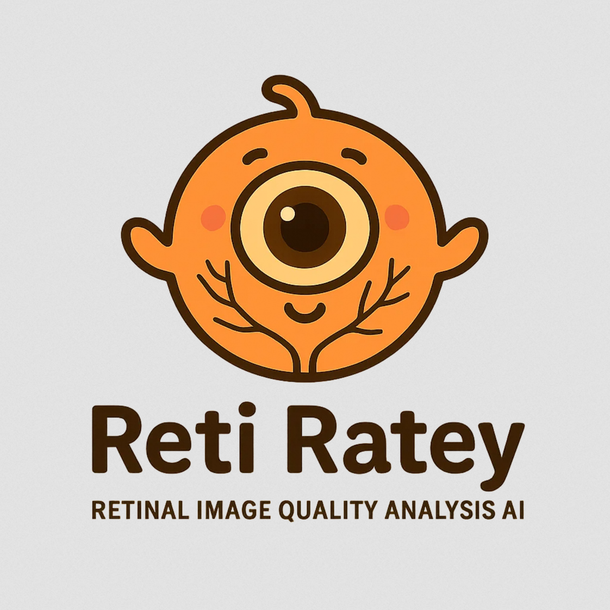

<p align="center">
  
</p>

# Reti Ratey 👁️  
**Fine‑grained retinal image quality assessment**

---

## 📌 What is Reti Ratey?

Reti Ratey is an AI model that rates the quality of retinal images. Particularly, it rates the quality of disc, macula, and vessels separately on a scale from 1 (very good) to 4 (unusable). For example, an image might be generally poorly illuminated, making it unusable for assessing the macula, borderline for the vessels, but still very good for assessing the disc. Designed as a research tool, it helps you understand which regions of an image are reliable for downstream analysis.

---

## 🌐 Web Demo

A web demo can be found [here](https://justinengelmann.github.io/RetiRatey_Inference_vpreview.html). No installation required, just drop images into the website and get the results. This demo will actually run the model on your own machine, entirely within your web browser. This means no data will be uploaded or sent anywhere. But of course, don’t take my word for it.

---

## 🚀 Usage

### Install Dependencies

```bash
# PyTorch version
pip install torch torchvision timm pillow

# ONNX version
pip install onnxruntime pillow numpy
```

### PyTorch

```python
import torch
from torchvision.transforms import functional as F
from PIL import Image
import timm

# download the weights, e.g. with
# wget https://github.com/justinengelmann/RetiRatey/releases/download/v1/retiratey_v1_statedict.pth
retiratey = timm.create_model('mobilenetv4_conv_small', num_classes=3, 
                              checkpoint_path='retiratey_v1_statedict.pth').eval()

@torch.inference_mode()
def reti_rate(fpath):
    # outputs are quality of the disc, macula, vessels, in that order
    # labels during training were normalised to [0,1]
    # NB: model can output values outside that range.
    img = Image.open(fpath).convert('RGB')
    img = F.to_tensor(F.resize(img, (384, 384)))
    img = F.normalize(img, [0.5] * 3, [0.5] * 3).unsqueeze(0)
    pred = retiratey(img).squeeze().cpu()
    # denormalize back to 1 - 4
    pred = 1 + (pred*3)
    return pred.numpy()
```

#### Example useage - running it on file paths in a pandas dataframe and adding the quality scores back.

```python
from pathlib import Path
import pandas as pd
import numpy as np

# for .apply with progress bar
from tqdm.notebook import tqdm
tqdm.pandas()

# replace with your folder and file extension (!)
imgs = list(Path('example_imgs/').glob('*jpg'))

df = pd.DataFrame()
df['fpath'] = imgs
df['fname'] = [_.name for _ in imgs]
df[['rr_disc', 'rr_macula', 'rr_vessels']] = np.stack(df.fpath.progress_apply(reti_rate).values)
```

The above is for running Reti Ratey on a single image at a time for convenience. This should be sufficient for multiple images per second even on regular machines. For higher throughput, you can of course use GPU acceleration and batching if needed.

### ONNX

The advantage of onnx is that you do not need to install the heavy pytorch binaries. Only onnxruntime, PIL and numpy are needed.

```python
import onnxruntime as ort
from PIL import Image
import numpy as np

# download the weights, e.g. with
# wget https://github.com/justinengelmann/RetiRatey/releases/download/v1/retiratey_v1.onnx
session = ort.InferenceSession('retiratey_v1.onnx')

def reti_rate_onnx(fpath):
    # outputs are quality of the disc, macula, vessels, in that order
    # labels during training were normalised to [0,1]
    # NB: model can output values outside that range.
    img = Image.open(fpath).convert('RGB')
    img = img.resize((384, 384), Image.BILINEAR)
    img = np.array(img, dtype=np.float32) / 255.
    img = np.transpose(img, (2, 0, 1))
    img = (img - 0.5) / 0.5
    img = np.expand_dims(img, 0)
    pred = session.run([session.get_outputs()[0].name], {session.get_inputs()[0].name: img})[0]
    pred = np.squeeze(pred)
    # denormalize back to 1 - 4
    pred = 1 + (pred * 3)
    return pred
```

---

## ❓ Questions & Feedback

If you use Reti Ratey, we'd love to hear how you get on with it — even if you encounter any issues. In fact, especially if you encounter any issues, we're always looking to improve it further.
